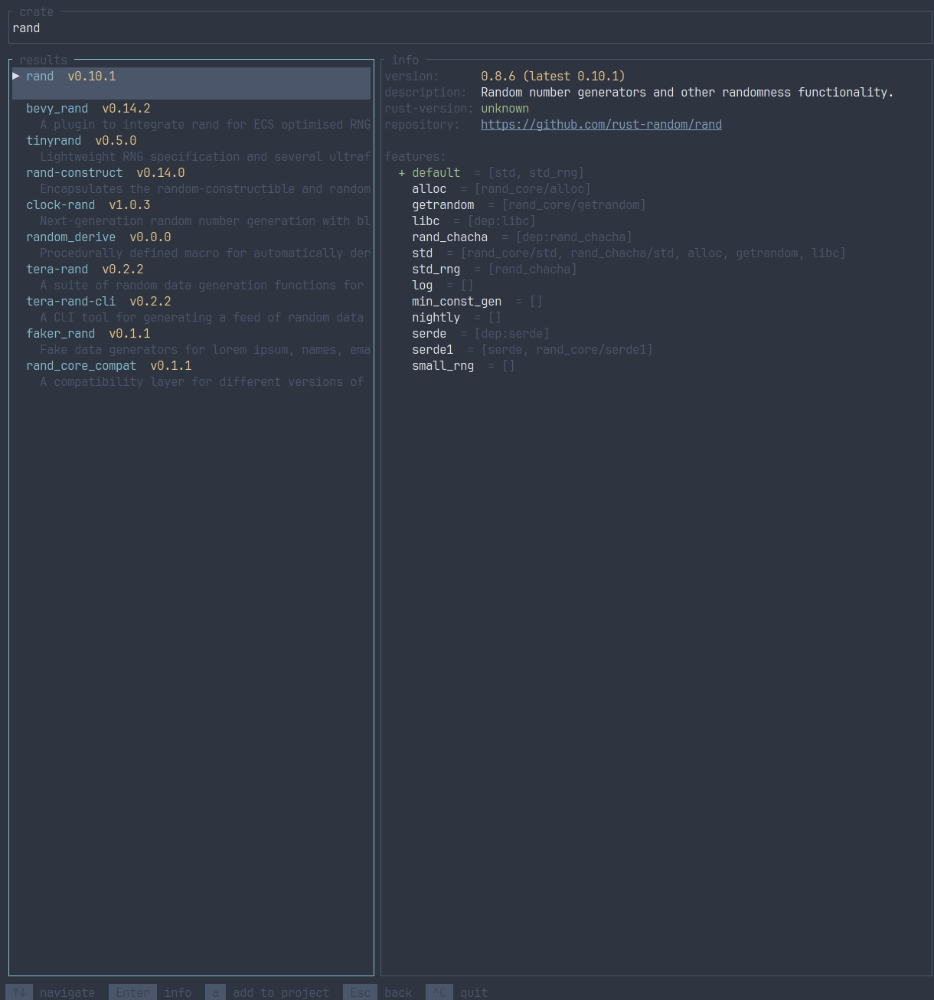

# crate-finder

A terminal UI for searching and browsing Rust crates, powered by cargo.

## Features

- Search crates.io directly from the terminal
- Browse results with keyboard navigation
- View crate details: version, description, minimum Rust version, repository, and features list
- Add crates to the current project with optional feature selection (when run inside a Rust project)

## Requirements

- Rust toolchain with `cargo` in `PATH`
- `cargo info` subcommand (ships with Cargo 1.83+)

## Installation

```
cargo install crate-finder
```

## Usage

```
crate-finder
```

Run it from anywhere for browsing. Run it from inside a Rust project (any directory that has a `Cargo.toml`) to enable the _add_ feature.


